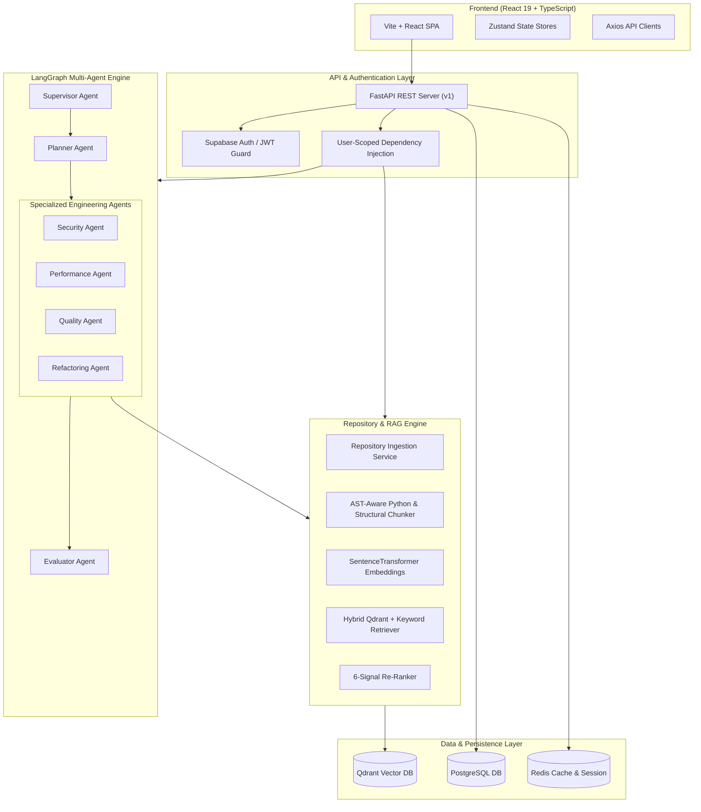

# KAI Code Studio — Software Engineering AI Agent

> An autonomous, multi-agent AI system for enterprise repository ingestion, structural code analysis, RAG-powered Q&A, automated code review, fix generation, static & isolated test verification, and automated GitHub pull request workflows.

---

## 🌟 Overview

**KAI Code Studio** is an end-to-end, multi-agent software engineering platform built with **React 19**, **FastAPI**, **LangGraph**, **PostgreSQL**, **Redis**, **Qdrant**, and **Supabase Authentication**. It bridges the gap between passive LLM code suggestions and enterprise-grade software development workflows by combining structural repository indexing, hybrid vector retrieval, stateful memory, multi-agent review collaboration, and real GitHub OAuth PR automation.

---

## 🎯 Problem & Solution

### The Problem
Traditional AI coding assistants operate in isolated single-prompt snippet contexts. They lack:
- Full repository awareness and structural code context.
- Multi-agent specialized review capabilities (security, performance, architecture, quality).
- Verification mechanisms (static checking and isolated test sandboxing).
- Direct integration with developer pull request workflows without manual copy-pasting.

### The Solution
KAI Code Studio provides:
1. **Live Repository Ingestion & Structural RAG**: AST-aware chunking for Python and multi-language structural parsing, indexing vectors into Qdrant for repository-scoped hybrid retrieval and re-ranking.
2. **LangGraph Multi-Agent Orchestration**: A Supervisor-Planner-Evaluator orchestration model coordinating specialized agents (Security, Performance, Quality, Architecture, Refactoring, Documentation, Test Generation).
3. **Automated Fix-to-PR Workflow**: Generates unified diffs, runs static code verification and isolated test sandboxing, commits changes locally, and pushes branches to create GitHub Pull Requests via authenticated user OAuth tokens.

---

## ✨ Key Features

- 🤖 **Multi-Agent Orchestration**: LangGraph-powered graph workflow with retry loops, confidence evaluation, and fallback bounds.
- 🛡️ **Automated Code Review**: Multi-category finding detection with severity levels, exact line references, and remediation recommendations.
- 🔍 **AST-Aware RAG Pipeline**: SentenceTransformer embeddings, Qdrant hybrid retrieval, 6-signal re-ranking, and grounded citation generation.
- 🔐 **GitHub OAuth Integration**: Server-side AES-128-CBC (`Fernet`) encrypted access token storage with strict per-user credential isolation.
- 🛠️ **Automated Fix & Verification**: Proposed fix diff generation, static AST verification, isolated test sandboxing, and direct branch-to-PR creation.
- 🧠 **Intelligent Tiered Memory**: Ephemeral Redis session memory, PostgreSQL long-term memory, and Qdrant semantic memory.
- 🐳 **Production Docker & CI/CD**: Full `docker-compose` orchestration with Nginx SPA reverse proxy and GitHub Actions CI matrix with PostgreSQL, Redis, and Qdrant services.

---

## 🏗️ Architecture



---

## 🤖 Agent Architecture

The multi-agent system uses **LangGraph** to execute state graph workflows:

| Agent | Responsibility |
| :--- | :--- |
| **Supervisor Agent** | Routes incoming user tasks to appropriate specialized agents and manages state transitions. |
| **Planner Agent** | Decomposes complex engineering requests into clear step-by-step sub-tasks. |
| **Security Agent** | Analyzes code for OWASP vulnerabilities, path traversal, injection, and credential exposure. |
| **Performance Agent** | Evaluates time complexity, memory allocation bottlenecks, and asynchronous execution paths. |
| **Quality & Architecture Agent** | Audits SOLID principle adherence, code maintainability, and structural dependencies. |
| **Evaluator Agent** | Evaluates synthesized agent outputs against minimum confidence thresholds (`0.40`) with max retry bounds. |

---

## 🔍 RAG Pipeline

```
Repository Files ──> Filter (.gitignore, binary) ──> AST-Aware Chunker
                                                            │
                                                            ▼
User Query ──> Hybrid Retrieval ──> 6-Signal Re-Ranker ──> Vector Index (Qdrant)
                     │                    │
                     ▼                    ▼
             Context Assembly ──> Grounding Validation ──> Citation Generator
```

---

## 🛠️ Tech Stack

### Frontend
- **Framework**: React 19, TypeScript, Vite
- **Styling**: Tailwind CSS, Lucide React Icons
- **State Management**: Zustand
- **Testing**: Vitest, React Testing Library

### Backend & AI
- **Framework**: Python 3.11+, FastAPI, Pydantic v2
- **Orchestration**: LangGraph, LangChain Core
- **AI Models**: Google Gemini 2.5 Flash / OpenAI GPT-4o
- **Embeddings**: SentenceTransformers (`all-MiniLM-L6-v2`)

### Persistence & Infrastructure
- **Relational DB**: PostgreSQL 15 + SQLAlchemy 2.0
- **Cache / Sessions**: Redis 7
- **Vector DB**: Qdrant 1.7+
- **Auth**: Supabase Auth (JWT)
- **Containerization**: Docker, Docker Compose, Nginx

---

## 🖼️ Application Views

> *UI View Cards*

| View | Description |
| :--- | :--- |
| **Dashboard** | Metrics overview, active repository statistics, and recent code review history. |
| **Repository Import** | Live GitHub repository listing and local directory onboarding wizard. |
| **Code Review Results** | Detailed finding list with severity tags, code snippets, recommendations, and fix workflows. |
| **Fix Verification Modal** | Proposed diff inspection, static verification status, and one-click GitHub PR creation. |

---

## 🚀 Local Setup Guide

### Prerequisites
- Node.js 20+
- Python 3.11+
- PostgreSQL 15, Redis 7, Qdrant running locally (or via Docker)

### 1. Environment Setup
```bash
# Clone repository
git clone https://github.com/tiekiran2008/KAI-code-studio.git
cd kai-code-studio

# Copy environment configurations
cp backend/.env.example backend/.env
cp frontend/.env.example frontend/.env
```

### 2. Backend Setup
```bash
cd backend
python -m venv .venv
source .venv/bin/activate  # On Windows: .venv\Scripts\activate
pip install -r requirements.txt

# Start backend server
uvicorn src.main:app --reload --port 8000
```

### 3. Frontend Setup
```bash
cd frontend
npm install
npm run dev
```
Access the application at `http://localhost:5173` (or `http://localhost:3000`).

---

## 🐳 Docker Setup

Spin up the entire production-ready stack in containers:

```bash
# Build and launch all services (PostgreSQL, Redis, Qdrant, Backend, Nginx Frontend)
docker compose up --build
```

---

## 🧪 Testing

### Backend Unit & Integration Tests
```bash
cd backend
pytest tests/unit/ -v
```

### Frontend Tests & Build
```bash
cd frontend
npm run test -- --run
npm run lint
npm run build
```

---

## 🔐 Security & Multi-User Isolation

- **Server-Side Token Encryption**: GitHub OAuth access tokens are encrypted using AES-128-CBC (`Fernet`) before database insertion.
- **Strict User Isolation**: All repository imports, vector searches, RAG queries, reviews, and memories are strictly scoped by `user_id`.
- **Command & Path Traversal Protection**: File operations enforce boundary checks; Git commands execute via non-shell argument lists (`shell=False`).

---

## 📁 Project Structure

```
.
├── backend/
│   ├── src/
│   │   ├── application/     # Use cases and services (RAG, Ingestion, Review, GitHub)
│   │   ├── core/            # Configuration, logging, errors, security
│   │   ├── domain/          # Entities and repository interfaces
│   │   ├── infrastructure/  # PostgreSQL, Qdrant, Redis, Tool adapters, Agents
│   │   ├── interfaces/      # FastAPI REST routes and dependency injection
│   │   └── main.py          # Application entrypoint
│   └── tests/               # Unit, integration, security test suite
├── frontend/
│   ├── src/
│   │   ├── api/             # REST API clients
│   │   ├── components/      # Reusable UI components
│   │   ├── pages/           # Page views (Dashboard, Reviews, Settings, Repositories)
│   │   └── store/           # Zustand state management
│   └── vite.config.ts
├── docs/                    # Architectural docs, demo guide, resume specs
└── docker-compose.yml       # Production stack orchestration
```

---

## 🔮 Future Improvements

- 🔄 Support for Bitbucket and GitLab repository connections.
- ⚡ Real-time WebSocket progress streaming for multi-step agent runs.
- 🧪 Automated execution of containerized test suites inside dynamic Docker sandboxes.
