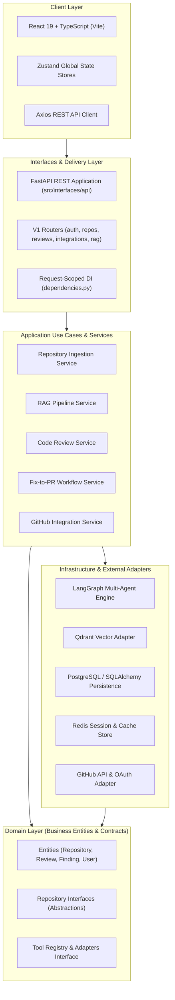
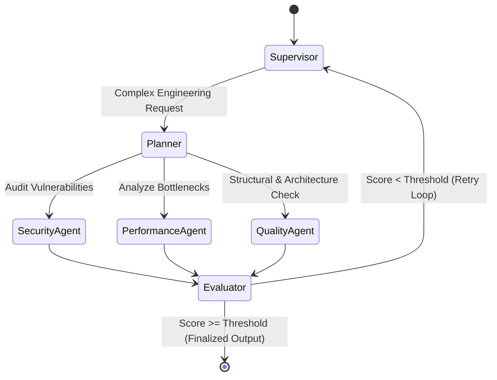
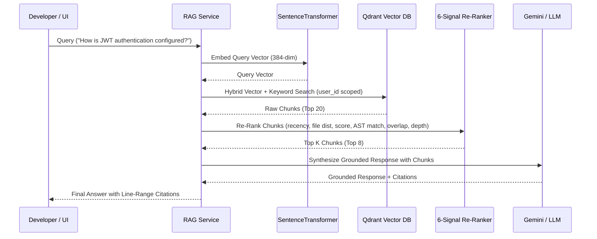

# KAI Code Studio — System Architecture Documentation

Detailed technical specification of KAI Code Studio's Clean Architecture, multi-agent orchestration, RAG engine, memory system, GitHub OAuth security, and infrastructure setup.

---

## 🏗️ 1. Overall System Architecture

KAI Code Studio adheres strictly to **Clean Architecture** principles, decoupling business domain logic from framework dependencies, database persistence, and external AI providers.

---

## 🤖 2. LangGraph Multi-Agent Engine

The multi-agent execution pipeline is built on **LangGraph**, executing state-bound graph traversals with supervisor routing, evaluations, and recursion controls.

### Agent Responsibilities

| Component | Class / Service | Function |
| :--- | :--- | :--- |
| **Supervisor Agent** | `SupervisorAgent` | Inspects task input, delegates execution to sub-agents, aggregates state. |
| **Planner Agent** | `PlannerAgent` | Generates execution plans for multi-step engineering tasks. |
| **Security Agent** | `SecurityAgent` | Scans source files for security vulnerabilities (injection, hardcoded keys, traversal). |
| **Performance Agent** | `PerformanceAgent` | Analyzes execution complexity ($O(n)$ bounds), database queries, and async IO. |
| **Quality Agent** | `QualityAgent` | Evaluates SOLID principles, module cohesion, coupling, and docstrings. |
| **Evaluator Agent** | `EvaluatorAgent` | Scores synthesized agent responses (`0.0 - 1.0`), enforcing retry policies. |

---

## 🔍 3. AST-Aware RAG Pipeline & Retrieval

The RAG pipeline provides hybrid vector retrieval with structural re-ranking and grounded citation generation.

---

## 🧠 4. Tiered Memory Architecture

1. **Short-Term Session Memory**: Ephemeral conversation history stored in **Redis** with configurable TTL (`1800s`).
2. **Long-Term Operational Memory**: Review metadata, findings, user profiles, and workspace settings persisted in **PostgreSQL**.
3. **Semantic Code Memory**: Cross-session code patterns, past review findings, and codebase context indexed in **Qdrant**.

---

## 🔐 5. Security & Isolation Boundaries

- **OAuth Encryption**: GitHub access tokens are encrypted at rest using AES-128-CBC (`Fernet`) before persistence in PostgreSQL.
- **Per-User Dependency Injection**: FastAPI dependencies inject the active user's OAuth token dynamically into request-scoped adapters (`GitHubToolAdapter`, `GitHubPullRequestService`).
- **Multi-Tenant Scoping**: All vector collections and SQL tables enforce `user_id` filtering on read/write operations.
- **Process Protection**: Git commands execute via explicit argument vectors (`shell=False`) avoiding shell expansion vulnerabilities.
