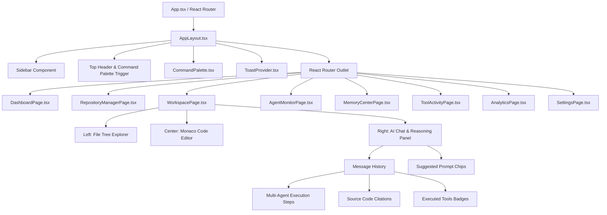

# Component Hierarchy

```mermaid
graph TD
    App[App.tsx / React Router] --> AppLayout[AppLayout.tsx]
    
    AppLayout --> Sidebar[Sidebar Component]
    AppLayout --> TopHeader[Top Header & Command Palette Trigger]
    AppLayout --> CommandPalette[CommandPalette.tsx]
    AppLayout --> ToastProvider[ToastProvider.tsx]
    
    AppLayout --> Outlet[React Router Outlet]
    
    Outlet --> Dashboard[DashboardPage.tsx]
    Outlet --> RepoManager[RepositoryManagerPage.tsx]
    Outlet --> Workspace[WorkspacePage.tsx]
    Outlet --> AgentMonitor[AgentMonitorPage.tsx]
    Outlet --> MemoryCenter[MemoryCenterPage.tsx]
    Outlet --> ToolActivity[ToolActivityPage.tsx]
    Outlet --> Analytics[AnalyticsPage.tsx]
    Outlet --> Settings[SettingsPage.tsx]
    
    Workspace --> FileExplorer[Left: File Tree Explorer]
    Workspace --> MonacoEditor[Center: Monaco Code Editor]
    Workspace --> AIChatPanel[Right: AI Chat & Reasoning Panel]
    
    AIChatPanel --> MessageList[Message History]
    MessageList --> AgentTraceAccordion[Multi-Agent Execution Steps]
    MessageList --> RAGCitationChips[Source Code Citations]
    MessageList --> ToolBadges[Executed Tools Badges]
    AIChatPanel --> SuggestedChips[Suggested Prompt Chips]
```
