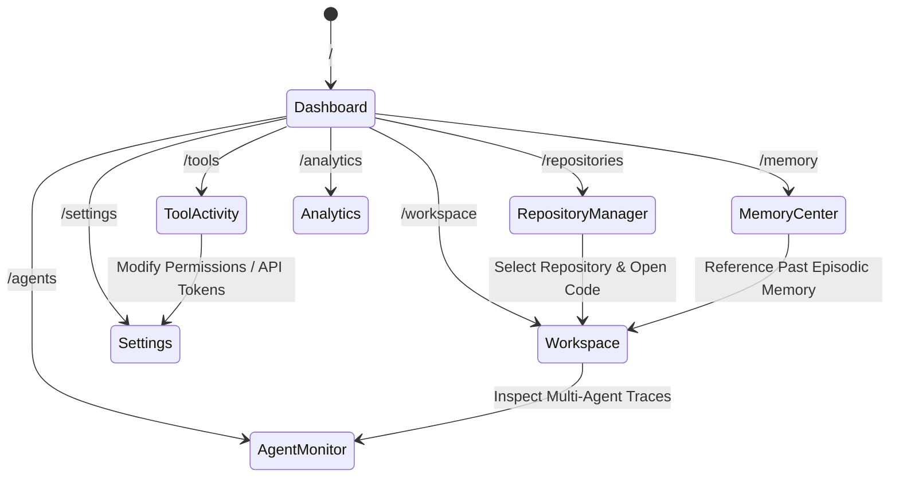

# Frontend Routing Diagram

```mermaid
stateDiagram-v2
    [*] --> Dashboard: /
    
    Dashboard --> RepositoryManager: /repositories
    Dashboard --> Workspace: /workspace
    Dashboard --> AgentMonitor: /agents
    Dashboard --> MemoryCenter: /memory
    Dashboard --> ToolActivity: /tools
    Dashboard --> Analytics: /analytics
    Dashboard --> Settings: /settings
    
    RepositoryManager --> Workspace: Select Repository & Open Code
    Workspace --> AgentMonitor: Inspect Multi-Agent Traces
    MemoryCenter --> Workspace: Reference Past Episodic Memory
    ToolActivity --> Settings: Modify Permissions / API Tokens
```
