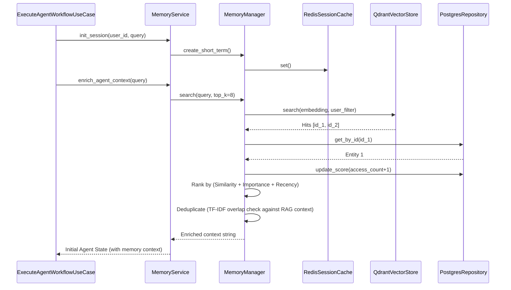
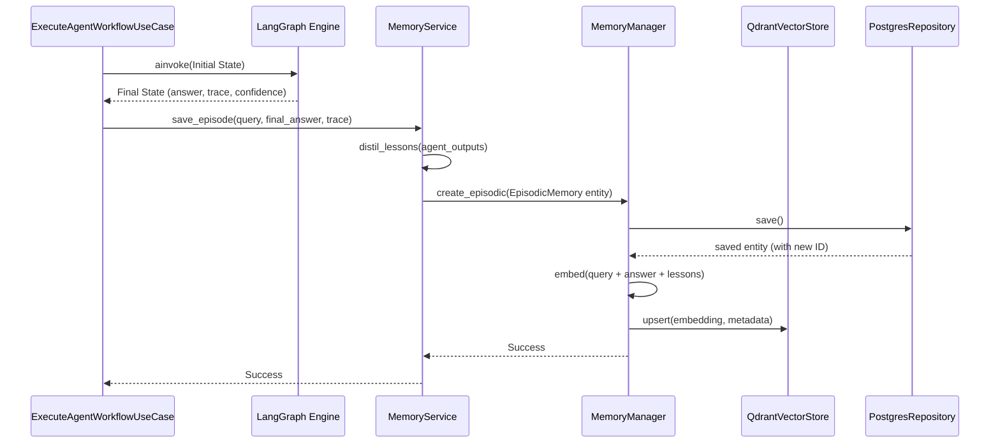

# Memory Sequence Diagrams

This document illustrates the interaction between the multi-agent workflow and the memory subsystem during a typical execution cycle.

## Pre-Execution: Context Enrichment

Before the LangGraph workflow begins, the `ExecuteAgentWorkflowUseCase` enriches the initial state with semantic memory.

## Post-Execution: Episodic Memory Persistence

Once the LangGraph workflow successfully completes and generates an answer, the trace is saved as an episodic memory.

