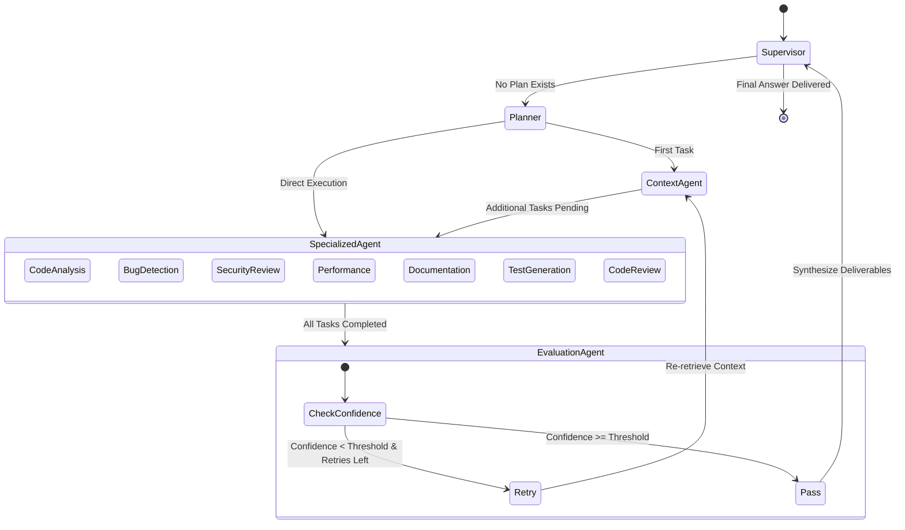
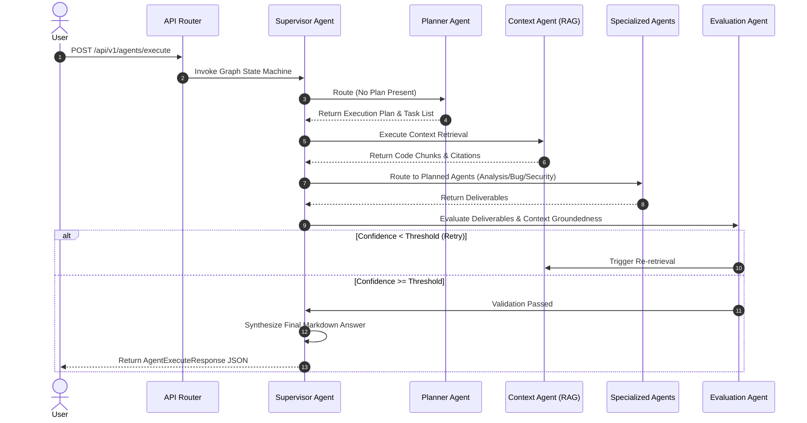

# Phase 6: Multi-Agent Software Engineering System Architecture

This document describes the design, execution lifecycle, routing mechanisms, and agent responsibilities of the LangGraph-powered autonomous multi-agent software engineering system.

---

## 1. Executive Summary

The Multi-Agent Software Engineering System serves as the core intelligence layer of the application. Built using **LangGraph**, it transforms passive retrieval into a collaborative team of 10 specialized engineering agents led by a **Supervisor Agent** and evaluated by a dedicated **Evaluation Agent**.

---

## 2. Specialized Agents

| Agent Name | Primary Responsibility | Key Outputs |
|---|---|---|
| **Supervisor Agent** | Flow coordination, routing, output synthesis | Final markdown answer for the user |
| **Planner Agent** | Task decomposition, execution sequencing | Dynamic subtask execution plan |
| **Context Agent** | Interfacing with RAG Engine (Phase 5) | Codebase snippets, citations, symbol context |
| **Code Analysis Agent** | Architecture, design patterns, symbol logic | Structural and design pattern analysis |
| **Bug Detection Agent** | Defect analysis, null pointer & leak detection | Root cause explanations & suggested fixes |
| **Security Review Agent** | OWASP audit, SQLi/XSS, secret detection | Severity-classified vulnerability reports |
| **Performance Agent** | Algorithmic complexity, loops, memory usage | Big-O bounds and optimization strategies |
| **Documentation Agent** | Docstrings, API references, READMEs | Technical documentation & guides |
| **Test Generation Agent** | Unit/integration tests, edge cases, mocks | Executable test suites (pytest/unittest) |
| **Code Review Agent** | Readability, maintainability, SOLID check | Code review & refactoring suggestions |
| **Evaluation Agent** | Groundedness check, quality verification | Confidence score & retry control signals |

---

## 3. LangGraph State Machine & Routing Logic

### 3.1 State Diagram

### 3.2 Execution Lifecycle Sequence

---

## 4. Shared State Model (`AgentState`)

All nodes read from and write to a unified shared state object (`AgentState`):
- `query`: Original natural language request.
- `plan`: Task breakdown generated by Planner Agent.
- `retrieved_context`: Accumulated codebase snippets from RAG engine.
- `agent_outputs`: Map of agent deliverables indexed by agent type.
- `citations`: Source file paths, lines, and confidence ratings.
- `confidence_score`: Quality rating assigned by Evaluation Agent (0.0 to 1.0).
- `groundedness_ratio`: Percentage of claims backed by evidence.
- `execution_trace`: Step-by-step audit log with timestamps and latencies.

---

## 5. Reliability & Error Recovery

1. **Recursion Limit**: Set to `25` steps (`AGENT_MAX_RECURSION_LIMIT`) to prevent infinite looping.
2. **Evaluation Feedback Loop**: Automatically retries retrieval up to `AGENT_EVALUATION_RETRIES_MAX` (2 times) if confidence falls below `0.40`.
3. **Structured Fallbacks**: Planner and Evaluation nodes utilize resilient JSON parsers with keyword fallback heuristics to withstand malformed LLM responses.
