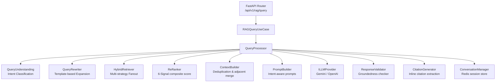
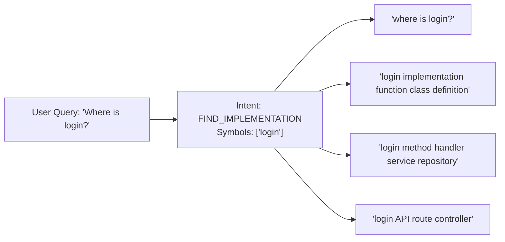
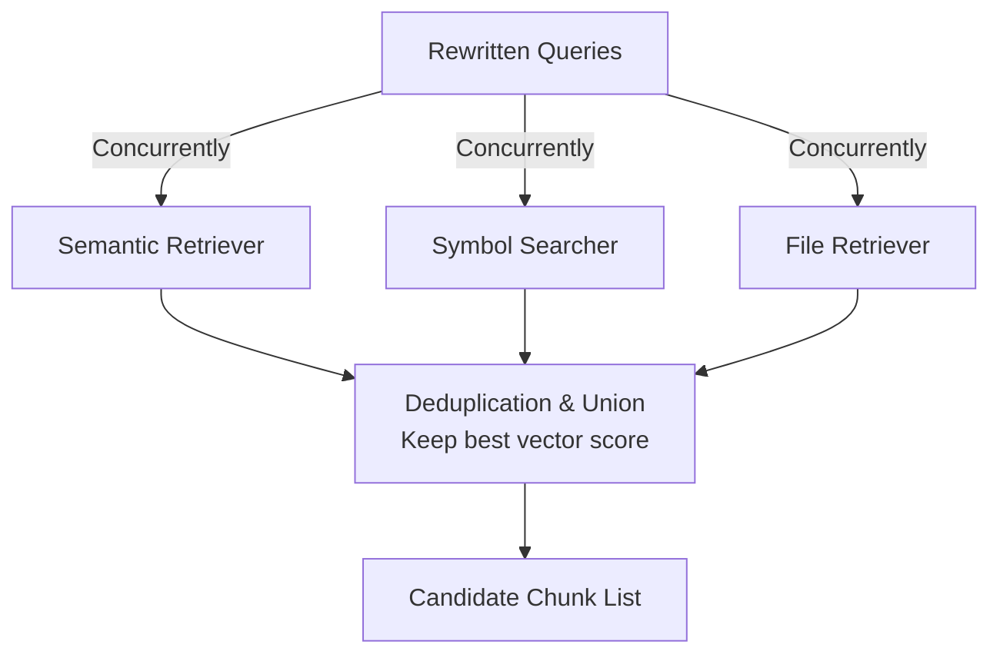
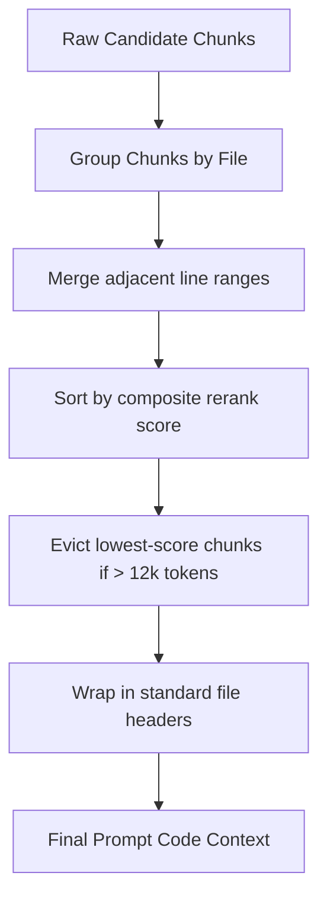
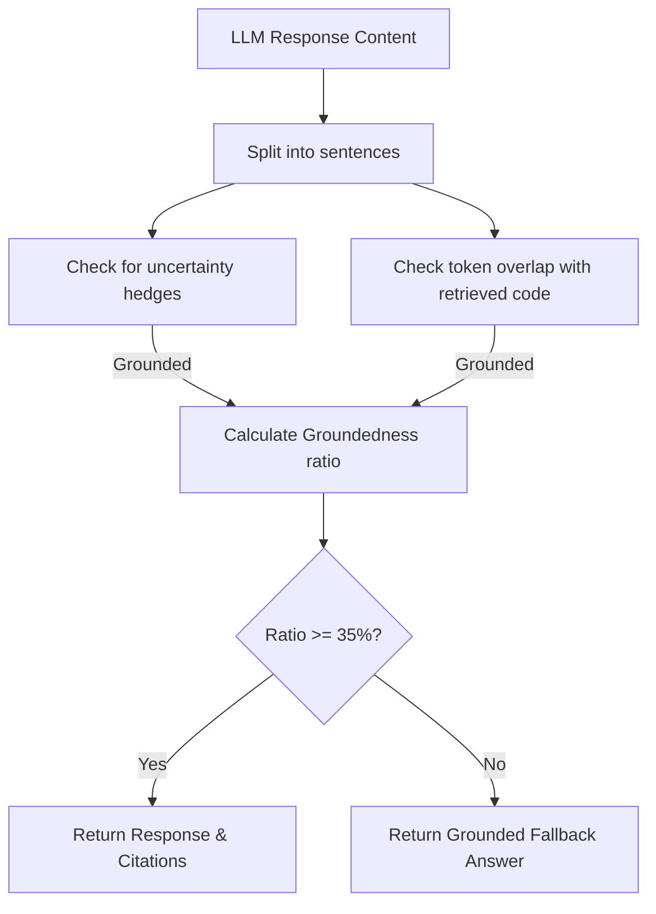

# Phase 5: Production-Grade RAG Engine for Code Understanding

This document describes the architectural decisions, pipeline stages, retrieval strategies, and prompt engineering methods behind the production-grade codebase RAG engine.

---

## 1. Architectural Strategy

The codebase RAG engine is built following **Clean Architecture** and **SOLID** principles. The domain layer defines abstractions and entity models that have zero external runtime or framework dependencies. The application layer coordinates the pipeline components via pure logic, while the infrastructure layer provides concrete integrations (Gemini SDK, OpenAI SDK, Redis connection, Qdrant client, PostgreSQL).

### Component Overview

---

## 2. RAG Pipeline Stages

### 2.1 Query Understanding
To avoid adding latency to the retrieval hot path, query intent classification is implemented using a **zero-LLM, keyword-weighted engine**. The engine checks the query against 9 specialized intent categories:
- Code Explanation
- Find Implementation
- Debug Issue
- Architecture Explanation
- Dependency Analysis
- API Explanation
- Security Review
- Performance Review
- Documentation Request

Entities (like CamelCase symbols, snake_case functions, and filenames with extensions) are extracted using optimized regular expressions.

### 2.2 Query Rewriting & Expansion
A query like *"Where is login?"* is expanded into multiple sub-queries. The rewriter maps the detected intent to predefined expansion templates and merges extracted symbols to construct up to 4 parallel retrieval queries. This improves retrieval recall significantly for short or ambiguous developer questions.

### 2.3 Retrieval Pipeline
The hybrid retriever runs several search paths concurrently using `asyncio.gather`:
1. **Semantic Search**: Dense vector search via Qdrant cosine similarity.
2. **Symbol Match**: Payload filtering in Qdrant for files where `symbol_name` matches extracted symbols.
3. **File Filter**: Prefix matching on the `file_path` attribute in Qdrant payloads.
4. **Multi-Query Retrieval**: Running all rewritten queries concurrently.

Candidates are merged by `chunk_id`, keeping the highest vector score.

### 2.4 Context Construction
The `ContextBuilder` aggregates raw retrieved chunks into a clean context window:
1. **Deduplication**: Filters out redundant chunks.
2. **Adjacent-Line Range Merge**: Groups chunks belonging to the same file. If chunk line ranges overlap or are within a 5-line tolerance, it merges them to prevent repeating the same file regions in the prompt.
3. **Token Budget Enforcement**: Measures length using a character-based estimator (~4 chars per token) and drops lowest-scored chunks first if they exceed the 12,000 token limit.
4. **Formatting**: Wraps each section in clear standard annotations (e.g. `// FILE: path/to/file.py (lines 10-35)`).

### 2.5 Prompt Engineering Strategy
The prompt builder selects one of 10 structured system prompts depending on intent. The prompt contains explicit citation rules:
> *When you reference code from the provided context, cite the source using this exact format on the same line: `[FILE: path/to/file.py, LINES: 10-45, SYMBOL: ClassName]`.*

This enforces citation discipline at the model generation level.

### 2.6 LLM Abstraction Gateway
The `ILLMProvider` decouples the application from provider libraries. The codebase ships with:
- **GeminiProvider**: Uses Google's GenAI SDK (gemini-1.5-pro by default) wrapped in `asyncio.to_thread`.
- **OpenAIProvider**: Uses `openai` async client (gpt-4o by default) with accurate local token counting via `tiktoken`.

Retries with exponential backoffs are applied on connection limits or rate limits using `tenacity`.

### 2.7 Response Generation & Validation
To prevent LLM hallucinations, the validator segments the generated answer into sentences and runs a token-overlap test. Every fact must share a meaningful vocabulary overlap (or recognize uncertainty hedges) with the retrieved context. If the ratio of grounded claims falls below `settings.MIN_CONFIDENCE_THRESHOLD` (35%), the response is rejected and a fallback notice is returned.

### 2.8 Citation & Session Management
- **Citation Engine**: Inline `[FILE: ...]` markers are parsed, mapped back to the retrieved source chunks, and enriched with confidence scores (0.95 for explicit, 0.75 for implicit matched symbols, 0.50 for top-scored residual sources).
- **Session Store**: Redis stores serialized conversation histories containing the last 10 turns per session, auto-expiring after 2 hours.

---

## 3. Configuration Parameters

Available tuning parameters in `core/config.py`:
- `GEMINI_API_KEY` / `OPENAI_API_KEY`: Model authentication credentials.
- `LLM_PROVIDER`: `"gemini"` or `"openai"`.
- `CONTEXT_WINDOW_TOKENS`: Maximum context size (default: `12000`).
- `MIN_CONFIDENCE_THRESHOLD`: Groundedness check threshold (default: `0.35`).
- `RAG_RESPONSE_CACHE_TTL`: Cache expiry for identical queries (default: `300` seconds).
- `CONVERSATION_TTL_SECONDS`: Session expiry in Redis (default: `7200` seconds).
