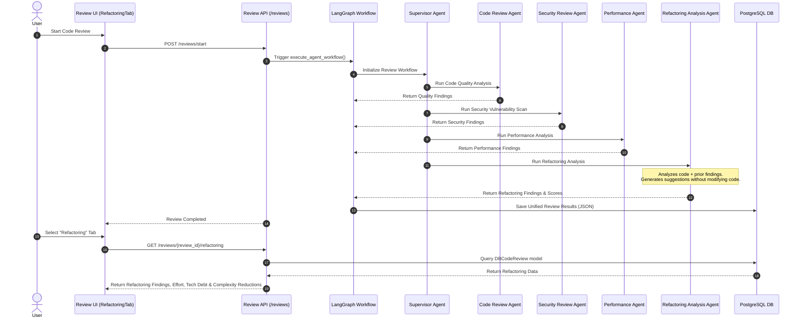

# AI Refactoring Workflow & Architecture

This document describes the enterprise-grade AI Refactoring Analysis pipeline (Phase 11.4) integrated into the Software Engineering AI Agent review system.

> [!IMPORTANT]
> **Safety Guarantee**: The AI Refactoring Agent **NEVER** modifies source code automatically. It exclusively generates structured, actionable recommendations with estimated effort, before/after previews, benefits, risks, and maintainability metrics.

---

## 1. Overview

The Refactoring Analysis Agent operates as an automated step within the unified review pipeline. It synthesizes findings from previous review steps (Code Quality, Security, Performance) alongside codebase context retrieved via the RAG Engine and Repository Index to produce actionable refactoring suggestions.

Execution Sequence:
`Repository Analysis → RAG Context → Memory Retrieval → Code Review → Security Analysis → Performance Analysis → Refactoring Analysis → Final Review Report`

---

## 2. Refactoring Analysis Sequence Diagram



---

## 3. Detected Smells & Analysis Catalog

The agent systematically analyzes repositories for 21 code smells and structural flaws:

1. **Long Methods**: Functions exceeding length guidelines requiring extraction.
2. **Large Classes**: Classes accumulating excessive responsibilities.
3. **God Objects**: Monolithic objects centralizing all domain logic.
4. **Duplicate Code**: Repeated logic suitable for extraction into helper utilities.
5. **Dead Code**: Unreachable, unused, or obsolete code paths.
6. **Feature Envy**: Methods accessing data of other classes excessively.
7. **Data Classes**: Dumb data containers lacking encapsulating methods.
8. **Switch Statement Smells**: Complex nested switches replaceable with polymorphism.
9. **Deep Nesting**: Indentation levels reducing code readability.
10. **High Cyclomatic Complexity**: Excessive execution paths and conditional branches.
11. **High Cognitive Complexity**: Hard-to-reason-about logic patterns.
12. **Long Parameter Lists**: Functions accepting too many arguments (suggest parameter object).
13. **Primitive Obsession**: Overuse of primitive types instead of domain objects.
14. **Tight Coupling**: Hard dependencies preventing modular testing and reuse.
15. **Low Cohesion**: Weak logical connection between class members.
16. **SOLID Principle Violations**: Non-conformance to SRP, OCP, LSP, ISP, or DIP.
17. **Missing Design Patterns**: Opportunities for Strategy, Factory, Observer, or Adapter patterns.
18. **Poor Exception Handling**: Swallowing exceptions or catching generic `Exception`.
19. **Poor Naming**: Uninformative, ambiguous, or misleading variable/function identifiers.
20. **Async Opportunities**: Blocking synchronous I/O replaceable with async operations.
21. **Resource Management Issues**: Unclosed connections, streams, or resource leaks.

---

## 4. Output Data Schema

Each refactoring suggestion returns structured attributes:

```json
{
  "refactoring_type": "Extract Method",
  "priority": "high",
  "category": "complexity",
  "file_path": "backend/src/services/review_service.py",
  "line_number": 42,
  "explanation": "Function process_review has a cyclomatic complexity of 18 and spans 120 lines. Extract sub-task processing into separate helper methods.",
  "current_problem": "Function process_review exceeds 120 lines with complex nesting",
  "suggested_refactoring": "Extract sub-task processing into helper functions _fetch_context and _execute_pipeline",
  "before_preview": "def process_review(review_id):\n    # 120 lines handling DB, RAG, and LLM calls",
  "after_preview": "def process_review(review_id):\n    context = _fetch_context(review_id)\n    return _execute_pipeline(context)",
  "benefits": [
    "Reduces cyclomatic complexity from 18 to 4",
    "Improves unit testability of individual steps"
  ],
  "risks": [
    "Internal helper methods require separate testing"
  ],
  "estimated_effort_hours": 2.0,
  "confidence_score": 0.94
}
```

---

## 5. API Reference

### `GET /api/v1/reviews/{review_id}/refactoring`

#### Headers
`Authorization: Bearer <access_token>`

#### Response (200 OK)
```json
{
  "refactoring_findings": [ ... ],
  "refactoring_priority": "high",
  "estimated_refactoring_effort": 8.5,
  "estimated_maintainability_improvement": 28.0,
  "estimated_technical_debt_reduction": 12.5,
  "estimated_complexity_reduction": 35.0
}
```
