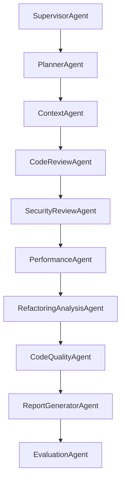

# AI Engineering Report Generator Workflow

The **AI Engineering Report Generator** (Phase 11.6) is an enterprise-grade agent within the LangGraph state graph. It aggregates all completed multi-agent analysis deliverables (Code Review, Security, Performance, Refactoring, Architecture & Code Quality) into executive-quality engineering reports across 5 export formats (PDF, HTML, Markdown, JSON, SARIF v2.1.0).

---

## 1. Multi-Agent Pipeline Integration

In the state graph (`src/application/agents/graph.py`), the `ReportGeneratorAgent` runs after the `CodeQualityAgent` and before the `EvaluationAgent`:

### Agent Deliverables Consumed

1. **Code Review Agent**: High-level readability, bug, and maintainability findings.
2. **Security Review Agent**: OWASP vulnerability findings, CWE mappings, severity ratings.
3. **Performance Agent**: CPU/Memory bottlenecks, Big-O complexity, optimization recommendations.
4. **Refactoring Agent**: Code smell detection, SOLID principles, method extraction recommendations.
5. **Code Quality Agent**: Clean Architecture compliance, layer dependency violations, maintainability index, quality scores.

---

## 2. Report Payload Structure (15 Sections)

The report payload is modeled as `EngineeringReportData` (`src/domain/entities/report_entity.py`):

1. **Executive Summary**: Narrative covering health, top risks, and recommendations.
2. **Repository Overview**: Tech stack, primary framework, language breakdown.
3. **Code Review Summary**: Overall findings & readability overview.
4. **Security Findings**: Critical/high severity vulnerability list and CWE mappings.
5. **Performance Findings**: Identified bottlenecks, CPU/Memory savings estimates.
6. **Refactoring Recommendations**: Priorities, categories, effort estimates.
7. **Architecture Assessment**: Layer dependency violations, clean architecture compliance.
8. **Health Metrics**: 10 scores (Overall Health, Risk, Security, Performance, Architecture, Maintainability, Tech Debt, Complexity, Documentation, Testability).
9. **Technical Debt Summary**: Estimated hours and breakdown by agent domain.
10. **Complexity Analysis**: Function and module complexity distribution.
11. **Maintainability Analysis**: Maintainability index and long-term risk factors.
12. **Hotspot Files**: High-complexity, high-debt files.
13. **Risk Assessment**: Overall risk level (`critical` | `high` | `medium` | `low`), summary, and factors.
14. **Priority Action Plan**: Top 20 prioritized action items sorted by severity & effort.
15. **Future Improvements**: Suggested long-term architectural improvements.

---

## 3. Supported Export Formats

The `ReportExporter` (`src/application/services/report_exporter.py`) converts `EngineeringReportData` into 5 formats:

- **Markdown (`.md`)**: GitHub-flavored markdown with score tables and structured sections.
- **HTML (`.html`)**: Self-contained dark-mode report with visual score gauges and responsive styling.
- **JSON (`.json`)**: Machine-readable complete JSON dump.
- **SARIF (`.sarif`)**: Static Analysis Results Interchange Format v2.1.0 standard schema.
- **PDF (`.pdf`)**: Rendered PDF document via WeasyPrint (with HTML fallback).

---

## 4. Side-by-Side Report Comparison

The `ReportService` provides side-by-side comparison between two historical report runs:
- Score deltas for all 10 health metrics.
- Finding count changes across all analysis categories.
- Highlighted improved and degraded metrics.
