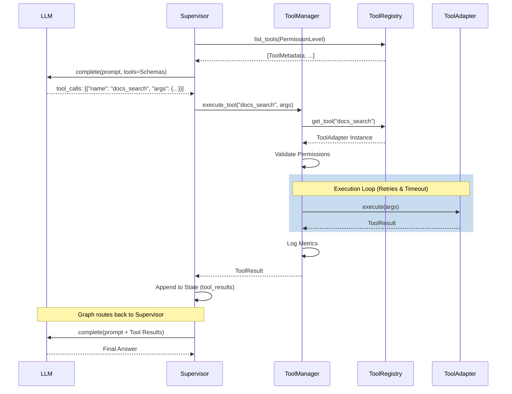

# Tool Sequence Diagram

```mermaid
sequenceDiagram
    participant LLM
    participant Supervisor
    participant ToolManager
    participant ToolRegistry
    participant ToolAdapter

    Supervisor->>ToolRegistry: list_tools(PermissionLevel)
    ToolRegistry-->>Supervisor: [ToolMetadata, ...]
    
    Supervisor->>LLM: complete(prompt, tools=Schemas)
    LLM-->>Supervisor: tool_calls: [{"name": "docs_search", "args": {...}}]
    
    Supervisor->>ToolManager: execute_tool("docs_search", args)
    
    ToolManager->>ToolRegistry: get_tool("docs_search")
    ToolRegistry-->>ToolManager: ToolAdapter Instance
    
    ToolManager->>ToolManager: Validate Permissions
    
    rect rgb(200, 220, 240)
        Note over ToolManager,ToolAdapter: Execution Loop (Retries & Timeout)
        ToolManager->>ToolAdapter: execute(args)
        ToolAdapter-->>ToolManager: ToolResult
    end
    
    ToolManager->>ToolManager: Log Metrics
    ToolManager-->>Supervisor: ToolResult
    
    Supervisor->>Supervisor: Append to State (tool_results)
    
    Note over Supervisor,LLM: Graph routes back to Supervisor
    
    Supervisor->>LLM: complete(prompt + Tool Results)
    LLM-->>Supervisor: Final Answer
```
